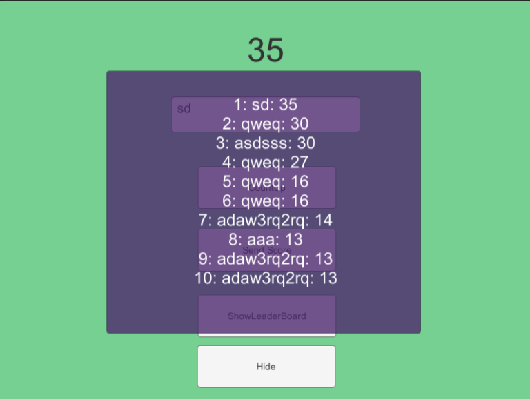
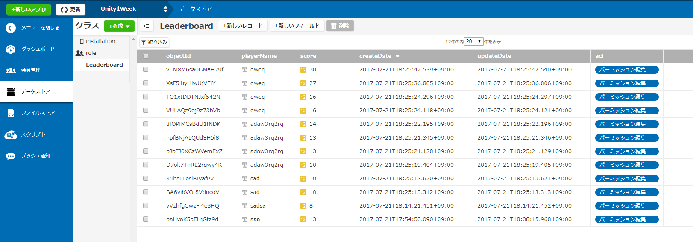

# Leaderboard For Unity WebGL

Unity WebGLで簡単に使えるランキング（リーダーボード）プラグインです。
主にUnity WebGLで開発されたゲームの公開サービス、[unityroom](https://unityroom.com/)のために用意しました。
PC/Mac/iOS/Androidでもそのままご利用いただけます。

スコアを保存するバックエンドにはニフティクラウド mobile backend(NCMB)を使用します。
NCMBは月間200万APIアクセス(通信回数)まで無料で使うことができます。

http://mb.cloud.nifty.com/

本ライブラリは[anzfactory](https://github.com/anzfactory)さんの「Yoshinani」ライブラリをベースとしています。
本人に許可をいただいた上で内容を発展させ、ゲーム中におけるプレイヤーごとのログインが不要になっています。
https://github.com/anzfactory/Yoshinani

（REST通信のための文字列生成処理などは、ほとんど同じです。）

## デモの試し方

ブラウザで試せるデモは[ここ](https://unityroom.com/games/leaderboarddemo)

Unity Editor上で試したり、自分のゲームに導入する場合はNCMBのアカウント取得が必要です。

1. NCMBのアカウントを[作成](https://console.mb.cloud.nifty.com/signup)し、管理画面内でリーダーボード用に「アプリ」を作成してAPIキー(Aplication KeyとClient Key)を入手する。
2. [releses](https://github.com/NCMBMania/LeaderboardForUnityWebGL/releases)からLeaderboardForWebGL.unitypackageをプロジェクトにインポートする
3. Demo.sceneを開く
4. シーン内のLeaderboardManagerオブジェクトにアタッチされている「NCMB Rest Controller」のフィールドにAplication KeyとClient Keyを設定する
5. エディタで実行。

操作：
 * Count Up クリックで数字が増加
 * Send Score スコアを送信
 * Show Leaderboard ランキングを取得・表示
 * Hide ランキングを非表示
 * Delete Local ObjectId and HighScore ローカルに保存されたオブジェクトIDとハイスコアを削除します。新規プレイヤーとしてテストすることができます。

サンプルのランキング表示画面はCanvasを使ったシンプルなものですが、このままゲームへパクってもＯＫです。




## ゲームへの組み込み方

### プレハブの配置
まず、Assets\NCMBLeaderboardWebGL\Prefab\LeaderboardManager をシーン上に配置します。
配置したら、上記デモ同様にAplication KeyとClient Keyを設定することで使用できるようになります。

LeaderboardManagerはシングルトンクラスですので、他のスクリプトからはLeaderboardManager.Instanceでアクセスできます。


### スコアを送信
LeaderboardManager.csの次の関数をコルーチンとして呼びます。

```csharp

StartCoroutine(LeaderboardManager.Instance.SendScore(playerName, score, false));

```
プレイヤーの名前とスコアを与えてコルーチンを実行します。

SendScoreの引数「isAllowDuplicatedScore」は、プレイヤー1人ごとのスコアの保持を1つにするか、複数にするかのフラグです。
自分でテストする際はレコードが1個しか登録できないと挙動を確認しにくいのでtrueにしておき、本番ではfalseにするとよいと思います。
（詳しくは下記の「仕様」をご覧下さい）

NCMBの管理画面では、「データストア」にLeaderboardという名前のクラスができ、ここにデータが溜まっていきます。



### リーダーボードを表示
NCMBに保存したスコアの一覧を取得する場合は、LeaderboardManager.GetScoreListByStr()を使います。
引数には、「上位いくつまでのスコアを取得したいか」と「処理が終わった後のコールバック」を渡します。
スコアは複数行のテキストに成形された状態で渡されるので、そのままUI.Text.textに渡せばすぐ表示できます。

```csharp

StartCoroutine(LeaderboardManager.Instance.GetScoreListByStr(10, (scores) =>
{
    leaderBoardText.text = scores;
}));

```
スコアを１つのテキストで表示せずに、順位ごとにUI内でフォントサイズを変えたり、パーツに分けたい場合は結果をScoreDataクラスとして受け取ることもできます。
ScoreDatasの中身はScoreクラスのリストで、ScoreクラスはフィールドplayerName, scoreを持っています。


```csharp

    [Serializable]
    public class ScoreDatas
    {
        public List<ScoreData> results;
    }

    [Serializable]
    public class ScoreData
    {
        public ScoreData(string playerName, int score)
        {
            this.playerName = playerName;
            this.score = score;
        }

        public string playerName;
        public int score;
    }

```

ScoreDataクラスを使った場合は、コールバックの中で任意のUIパーツに情報を流し込んであげるとよいでしょう。

```csharp

        StartCoroutine(LeaderboardManager.Instance.GetScoreList(10, (LeaderboardManager.ScoreDatas scoreDatas) =>
        {
            int i = 0;
            foreach(LeaderboardManager.ScoreData scoreData in scoreDatas.results)
            {
                leadarboardPlayerNameText[i].text = scoreData.playerName;
                leadarboardScoreText[i].text = scoreData.score;
                i++;
            }
        }));
```

ScoreDataクラスにプロパティを足して、たとえばプレイヤーがメッセージを残せる機能などを足すと面白いかと思います。

## リーダーボードの仕様
このリーダーボードは、1人のプレイヤーは記録を1つしか持てないようになっています。
たとえば同一プレイヤーが98点の後に99点を出した場合でも、リーダーボード上は99点の方しか表示されません。

内部的には、NCMBへスコアを保存したタイミングでPCごとにIDを割り振っています。
これは、NCMB側から振り出されたレコードのIDを利用したもので、IDはPlayePrefsを使ってローカルに「ObjectId」として保存されます。
つぎにスコアを送信しようとした際、PlayerPrefsにObjectIDが保存されている場合は新規にレコードを作成せず、同じOjbectIDのレコードを更新する処理としています。

ローカルには同時に自己ハイスコアも記録しています。
スコアを更新しようとした際、この自己スコアと比較して大きかった場合のみ送信処理を行っています。

Demoでは「Delete Local ObjectId and HighScore」ボタンを押すことによって、PlayerPrefsで保存されたObjectId, HighScore, PlayerNameを削除し、「別のＰＣでアクセスしている」のと同じ状態をエミュレートすることができます。

## ライセンス
ライセンスはMITです。
